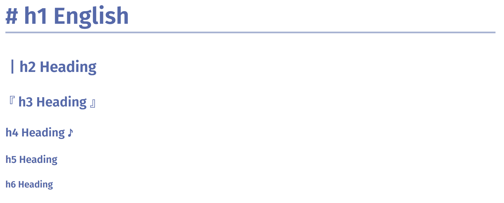
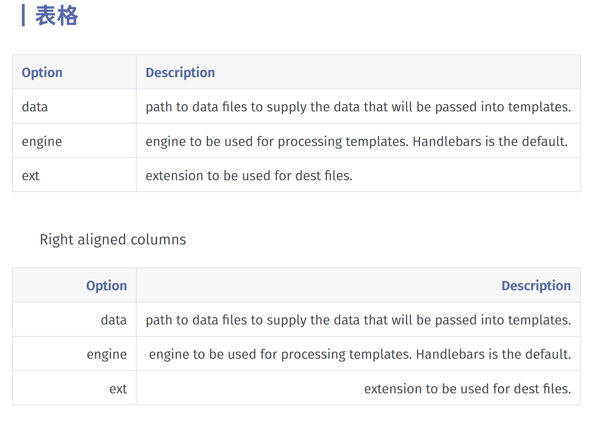
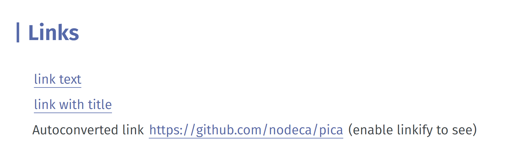

<h1 align="center">
  Fugu
  </h1>

  <a href="./README.md">简体中文</a> | English
   
   
  

    <strong>Fugu</strong> is a <strong>Typora</strong> theme based on <a href="https://github.com/YiNNx/typora-theme-lapis">YiNNx/typora-theme-lapis</a>.
  

## Introduction

The complete demo PDF is available [here](./演示.pdf)。

Currently only the light theme is implemented.

Based on [YiNNx/typora-theme-lapis](https://github.com/YiNNx/typora-theme-lapis) modified, also modified from [Theigrams/My-Typora-Themes](https://github.com/Theigrams /My-Typora-Themes), [billchen2k/typora-theme-next](https://github.com/BillChen2K/typora-theme-next) and other themes have been inspired. Thank you for these excellent themes!

- Font:

  - [GlowSansSC](https://github.com/welai/glow-sans): Future black, the font selected for the `next` theme.
  - [MonaspaceArgon](https://github.com/githubnext/monaspace): A monospaced font that I personally particularly like, launched by Github.

- Code highlighting: Ported from [akamud/vscode-theme-onelight](https://github.com/akamud/vscode-theme-onelight/tree/master).

## Usage

After downloading, place the `fugu.css` and `fugu` folders in the theme directory to enable them.

> fugu.css is the theme, and the fugu folder mainly contains fonts.

## Preview

### Title

### Horizontal Rules

### Emphasis

### Blockquotes

### Lists

### Code

### Table

### Links

### Plugins

