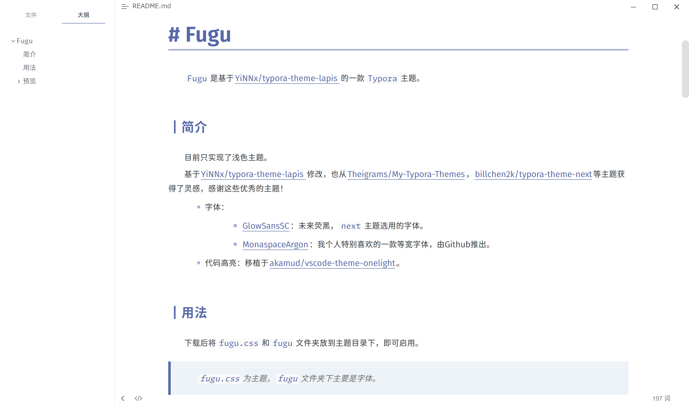
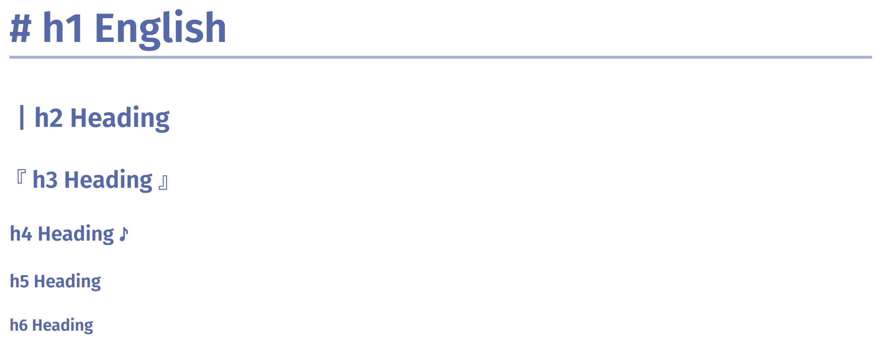
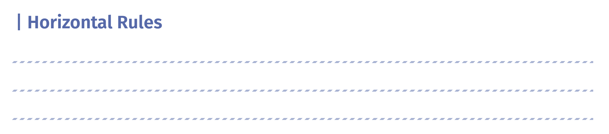
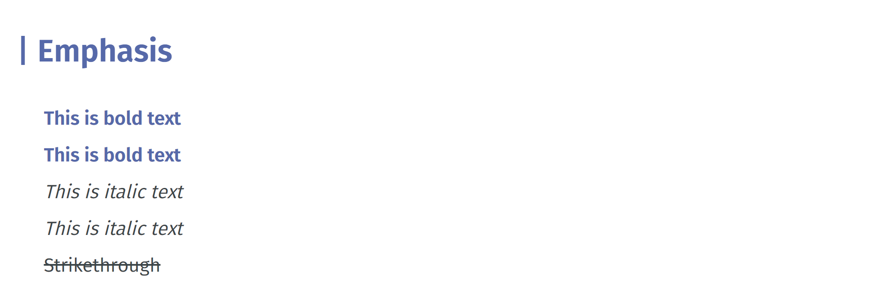
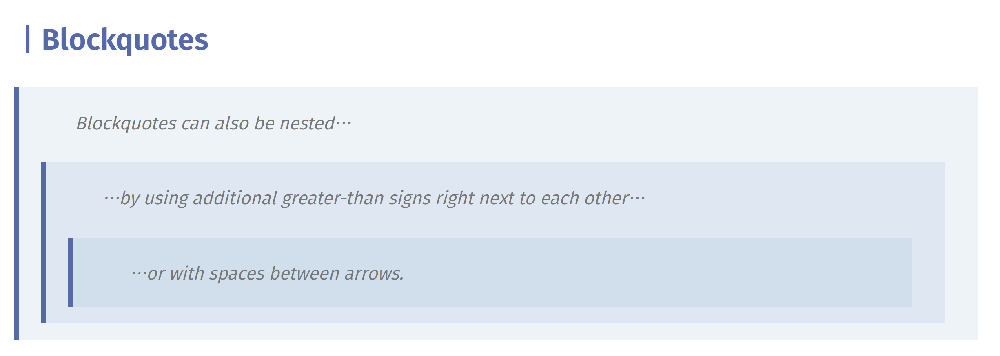
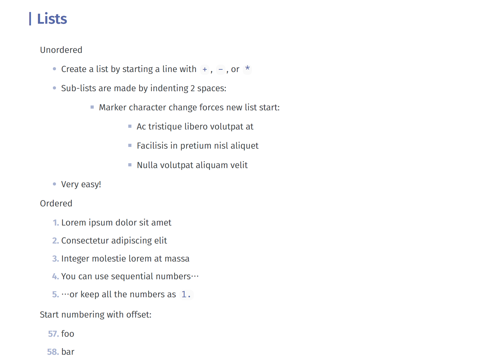
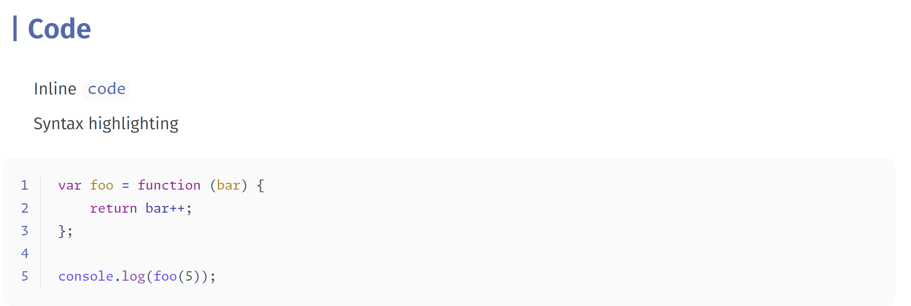
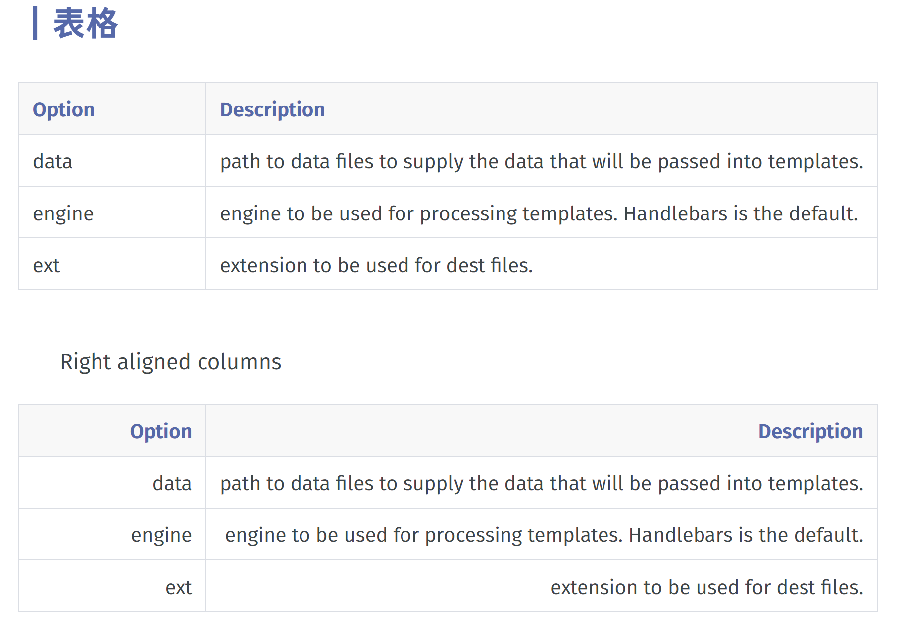
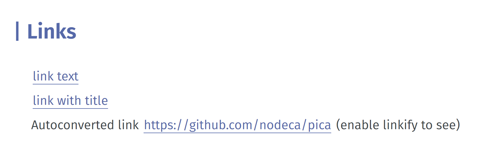
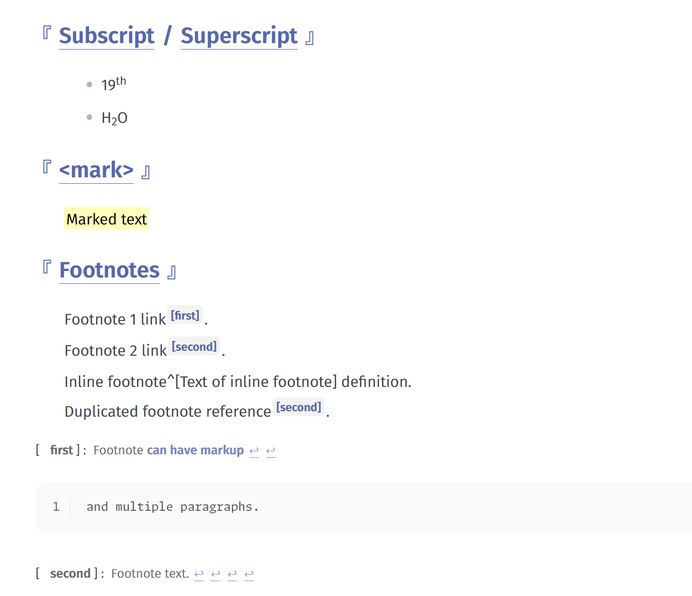

# Fugu

`Fugu`是基于[YiNNx/typora-theme-lapis ](https://github.com/YiNNx/typora-theme-lapis)的一款`Typora`主题。

## 简介

目前只实现了浅色主题。

基于[YiNNx/typora-theme-lapis ](https://github.com/YiNNx/typora-theme-lapis)修改，也从[Theigrams/My-Typora-Themes](https://github.com/Theigrams/My-Typora-Themes)，[billchen2k/typora-theme-next](https://github.com/BillChen2K/typora-theme-next)等主题获得了灵感，感谢这些优秀的主题！

- 字体：
  - [GlowSansSC](https://github.com/welai/glow-sans)：未来荧黑，`next`主题选用的字体。
  - [MonaspaceArgon](https://github.com/githubnext/monaspace)：我个人特别喜欢的一款等宽字体，由Github推出。

- 代码高亮：移植于[akamud/vscode-theme-onelight](https://github.com/akamud/vscode-theme-onelight/tree/master)。

## 用法

下载后将`fugu.css`和`fugu`文件夹放到主题目录下，即可启用。

> `fugu.css`为主题，`fugu`文件夹下主要是字体。

## 预览

### 标题

### 分割线

### 强调

### 引用块

### 列表

### 代码

### 表格

### 链接

### 插件支持

